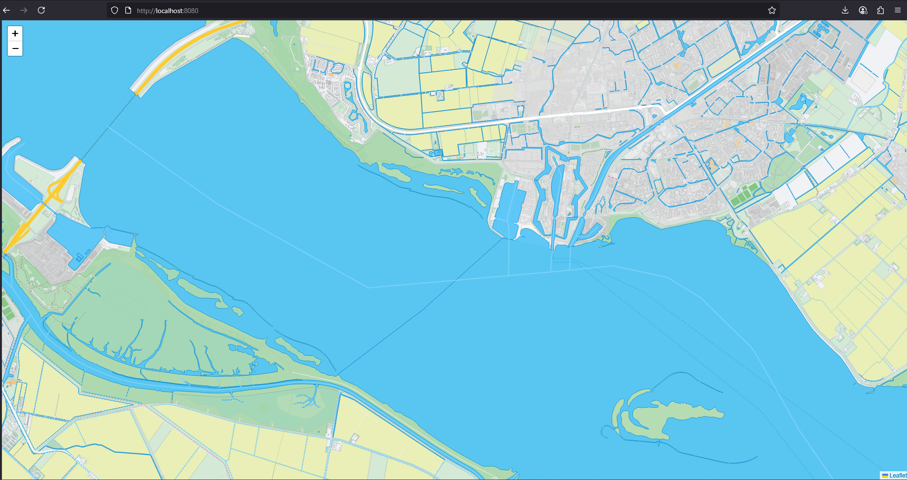

# MBTiles Server with Custom Styles

## Overview
This project is a lightweight MBTiles server built with Flask, designed to serve vector tiles from an MBTiles database and render them on a web-based map with custom styling. It leverages a thread pool for efficient tile request handling and includes a Leaflet-based frontend for map visualization. The server delivers `.pbf` (Protocol Buffer Format) tiles and static files, with zoom-dependent styles defined in `styles.js` for features like water, landcover, roads, and points of interest (POIs). Sample MBTiles files can be downloaded from `https://osm.dbtc.link/mbtiles/`.




## Features
- **Flask-based Server**: Serves vector tiles via `/tiles/<z>/<x>/<y>.pbf`.
- **Thread Pool**: Manages concurrent tile requests with a custom `ThreadPool` class.
- **Custom Styling**: Defines map feature styles in `styles.js` based on zoom levels.
- **MBTiles Support**: Queries SQLite-based MBTiles databases and decompresses `.pbf` tiles.
- **Static File Serving**: Delivers `index.html` and other assets for map display.
- **Configurable Environment**: Uses a `.env` file for database path, host, port, and thread settings.

## Requirements
Dependencies are listed in `req.txt`:
- Flask (3.1.1)
- blinker (1.9.0)
- click (8.2.1)
- colorama (0.4.6)
- itsdangerous (2.2.0)
- Jinja2 (3.1.6)
- MarkupSafe (3.0.2)
- Werkzeug (3.1.3)

Install them with:
```bash
pip install -r req.txt
```

## Setup Instructions
1. **Clone the Repository**:
   ```bash
   git clone <repository-url>
   cd <repository-directory>
   ```

2. **Download an MBTiles File**:
   - Sample MBTiles files are available at `https://osm.dbtc.link/mbtiles/`. For example, download `2024-12-27-europe.mbtiles` or `2025-08-02-planet.mbtiles`.
   - Save the file to a `data/` directory in the project root (create the directory if it doesn’t exist).

3. **Configure Environment**:
   - Edit the `.env` file to set:
     - `DATABASE`: Path to the MBTiles file (e.g., `data/2024-12-27-europe.mbtiles`).
     - `HOST`: Server host (default: `localhost`).
     - `PORT`: Server port (default: `8080`).
     - `MAX_THREAD`: Maximum threads (default: `10`).
     - `MAX_QUEUE_SIZE`: Maximum task queue size (default: `2000`).
     - `TOKEN`: Optional authentication token.

4. **Run the Server**:
   ```bash
   python start.py
   ```
   The server will start at `http://localhost:8080` (or the configured host/port).

5. **Access the Map**:
   - Open `http://localhost:8080` in a browser to view the demo map using the downloaded MBTiles file.
   - Static files (`index.html`, `styles.js`) are served from the Flask static folder.

## Project Structure
- `start.py`: Main Flask app for serving tiles and static files.
- `thread_pool.py`: Custom thread pool for concurrent tile requests.
- `env_parser.py`: Parses `.env` for configuration.
- `database_handler.py`: Handles SQLite queries and tile decompression.
- `index.html`: Leaflet-based frontend for map visualization.
- `styles.js`: Custom styles for map features.
- `req.txt`: Python dependencies.
- `.env`: Environment configuration.

## Custom Styles
The `styles.js` file defines zoom-dependent styles (0–22) for:
- **Water**: Blue fill with varying opacity.
- **Waterways**: Styled lines with labels for rivers/canals.
- **Landcover**: Colors for forests, grasslands, wetlands, etc.
- **Roads**: Varying weights/colors by road type and zoom.
- **POIs**: Colored markers for hospitals, schools, etc., with labels.
- **Place Labels**: Bold city/town names at higher zooms.

## Usage
- Access tiles at `/tiles/<z>/<x>/<y>.pbf` for map clients.
- View the demo map at `/` with a downloaded MBTiles file.
- Customize `styles.js` to adjust map appearance.

## Notes
- Ensure downloaded MBTiles files contain valid, decompressible `.pbf` tiles.
- Available sample files at `https://osm.dbtc.link/mbtiles/` include regional datasets (e.g., Netherlands, Europe, Africa) and a global `planet` dataset.
- Monitor console logs for debugging tile or database issues.